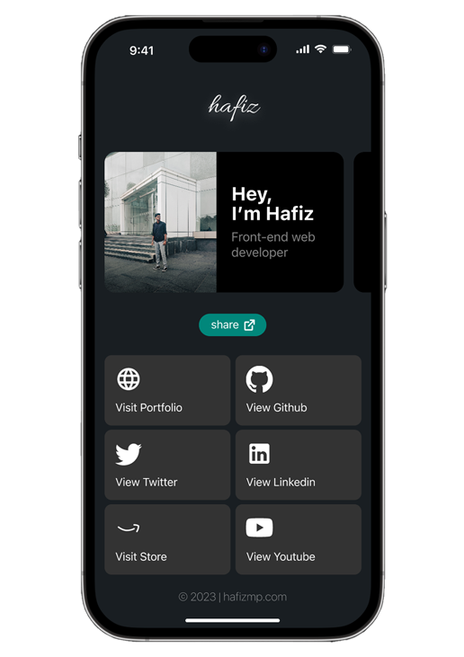

<h1 align="center">
   
  
   
  Social-media Profile Linker UI
   
</h1>

<h4 align="center">The profile linker web app is a tool for linking and sharing a user's social media profiles with others. The user interface is designed to be intuitive and user-friendly, allowing users to easily connect their social media accounts and share them with others. The goal of the project is to provide a streamlined solution for users to manage and share their online presence across multiple social media platforms.</h4>

  <a href="#🛠-overview">Overview</a> •
  <a href="#🚀-built-with">Build with</a> •
  <a href="#👉🏼-links">Live links</a> •

<h5 align="center">Don't forget to give a ⭐️ </h5>

## 🛠 Overview

- Adapted to mobile screen.
- Static app
- Used on React.js
- Made Curousel using Swiper.js
- Stunning UI

## 🚀 Built with

- [![ReactJS][ReactJS]][ReactJS-url] [![SASS][SASS]][SASS-url] [![SwiperJS][SwiperJS]][SwiperJS-url]

## 👉🏼 Links

- ⭐️ LIVE LINK : [Here](https://connecthafiz.netlify.app/)

[ReactJS]: https://img.shields.io/badge/React%20JS-03001C?style=for-the-badge&logo=react&logoColor=86E5FF
[ReactJS-url]: https://reactjs.org/https://reactjs.org/

[SASS]: https://img.shields.io/badge/SASS-FFFFFF?style=for-the-badge&logo=sass&logoColor=FF78F0
[SASS-url]: https://sass-lang.com/

[SwiperJS]: https://img.shields.io/badge/SWIPER.JS-001253?style=for-the-badge&logo=SWIPER&logoColor=2146C7
[SwiperJS-url]: https://swiperjs.com/
